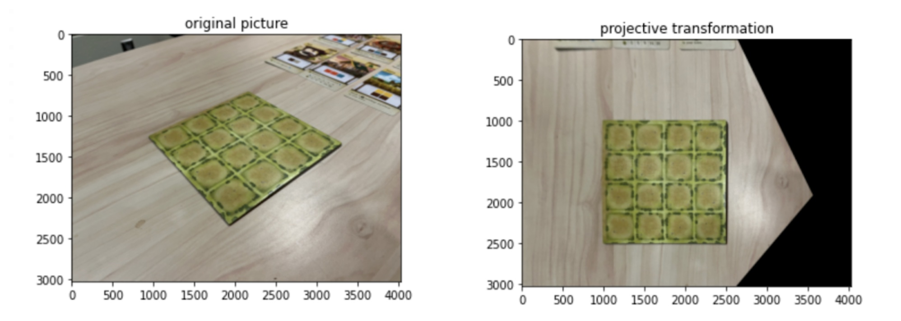

# Tiny Towns Scorer
\
**Figure 1.** A game state from the board game Tiny Towns alongside the recognized digital game state. Fourteen of the sixteen tokens were identified correctly.

In the board game Tiny Towns, a player's score is determined by pieces arranged into a 4x4 grid. We propose a model for calculating a player's score using computer vision. We combine object detection, feature matching, and homography in our model. We introduce the problem, detail initial experiments, and present a final model. Overall, the model achieves high accuracy on clear images, but poorly on images taken at distance or at oblique angles.

# Code structure
- training.ipynb
    - Data loading, data augmentation, and training the model
- scorer.ipynb
    - Testing the model, forming the grid, and homography via ORB
- experiments.ipynb
    - Earlier tests/experiments from preliminary stages of the project

# Data
## Collection
Our dataset of images consists of Tiny Towns game boards, tokens, and game states taken by smartphones periodically during a game of Tiny Towns we played (Figure 2).

\
**Figure 2.** Experimental setup.

## Annotation and Class Imbalance
To label the data, we used the Computer Vision Annotation Tool (CVAT) [[3]](#references) and manually drew rectangular bounding boxes around the board and game pieces.

Since our dataset consisted of only a single game of Tiny Towns, there were differences in the number of images collected for each type of token, leading to a class imbalance. For example, some pieces comprised as many as 10-12% of tokens, whereas others were as few as 2-4% (Figure 3).

\
**Figure 3.** Dataset class breakdown.

## Augmentation
When training a neural network, a relatively small number of images in the dataset could lead to overfitting. To combat this, we used a preprocessing technique called data augmentation on the training dataset to create new images from existing ones (Figure 4).

\
**Figure 4.** Examples of data augmentation.

# Experimentation
Before developing our final model, we experimented with other detection and classification techniques to solve our problem.

## Manual Corner Detection
We manually selected the corners of the game board in a test image and used those 4 coordinates with the scikit-image transform module to perform homography. We saw good results with this method as can be seen in Figure 5, but manual selection is tedious.

\
**Figure 5.** An example of projective transformation using manual corner detection.

## Harris Corner Detection
We attempted Harris Corner Detection to detect the four corners to apply the transformation above, but our observations and tests led to poor results. Instead of successfully finding corner points, our test image would result in looking glitched with a large mass of dots as seen in Figure 6.

\
**Figure 6.** The "corners" found on a test image after utilizing Harris Corner Detection.

## Hough Line Detection
\
**Figure 7.** The left half displays the lines found in a single board image; the right half displays the perpendicular and parallel lines found after analysis.

Using Hough Line Detection and the knowledge that the game board is a 4x4 grid, we identified the lines most likely to be the 4x4 grid in an image from our data set. Continuing, we determine the subset of lines that are all parallel and perpendicular to each other and group them by similarity. However, the detected "grid" is still not perfect (Figure 7).

## ORB
Our last experiment focused on interesting *features*, rather than continuing to rely on corners and edges. We used the ORB algorithm [[9]](#references) to identify and construct these features and create lists of feature points in both a query and test image.

For each feature in a query image (Figure 8), we use a brute force algorithm to find its two nearest neighbors in the test image, as measured by Hamming distance. We then filtered this list using Lowe's ratio test [[7]](#references), keeping only features whose distance to their 1st-nearest neighbor is less than 70% of the distance to their 2nd-nearest neighbor. These remaining "good" matches (keeping only the first neighbor) are then used to construct a projective transformation (Figure 9).

\
**Figure 8.** Features selected via ORB.

\
**Figure 9.** An overhead test image (upper left), matching features (bottom), and transformed result (upper right).

# Final Model
## Motivation
Hoping to achieve better accuracy than ORB, we then sought to employ a convolutional neural network (CNN). Our final model takes advantage of both a neural network based on the RetinaNet [[6]](#references) architecture, as well as the ORB feature matching discussed earlier.

## Training
We use KerasCV [[11]](#references) to implement and train the network. First, the ResNet50 portion of the network is loaded with weights from a version of ResNet50 pretrained on ImageNet. This portion of the network's weights are frozen and never updated. To train the other parts of the network, we construct a training pipeline: annotated images are resized to 512x512, shuffled in groups of 128, and then batched into groups of 16. These batches are preprocessed with data augmentation to expand the dataset. The model was then allowed to train for 128 epochs before the validation loss failed to improve for 10 epochs and training was stopped.

## Projective Transformation
The trained neural network outputs bounding boxes, classes, and a confidence score for detected objects in the image. A visualized example can be seen in Figure 10.

\
**Figure 10.** Objects and their classes detected by the trained neural network. Some game pieces have been detected as multiple objects.

The next part of the model identifies the detected bounding box for a game board with the highest confidence score. The model then slightly expands the box and extracts the corresponding region of the image.

Finally, the model uses OpenCV [[1]](#references) to perform ORB-based feature matching as described in [ORB](#orb), using 5000 features. Provided a sufficient number of good matches are found, we construct a projective transformation to an overhead perspective.

## Constructing the Grid
Using homography, the center points of the remaining bounding boxes are transformed into the reference perspective. In this perspective, the points are easily partitioned into a 4x4 grid. Since the network may predict multiple objects within one tile on the grid, we select the object with the highest confidence score. This grid of classified objects is the final output of the model, visualized in Figure 1. A flowchart of the complete model can be seen in Figure 11.

\
**Figure 11.** Our final model for Tiny Towns Scorer.

# Results
## COCO Metrics
We evaluated the neural network portion of our model using COCO metrics.

In general, precision refers to the number of true positives out of all the positives that were predicted by the model, while recall measures the percentage of true positives out of all actual positives in the dataset.

Both metrics provide valuable insight for us. A high precision rate for tokens would infer that our model's classification of those tokens is good. In contrast, a high recall score would indicate that our model is good at detecting all tokens that are actually within the image. As seen in Figure 12, for the game board and the well, our model does a good job in both precision and recall metrics which is likely due to the unique shape of the tokens. Overall though, our model has a low precision metric and an average recall metric. Our model is able to do a decent job at picking up a majority of the tokens in the image, but doesn't have consistency with its classification.

\
**Figure 12.** COCO metrics across all game images.

## Accuracy
To evaluate the complete model, we compared the grid of class predictions output by the model to the grid of actual objects present in the image. This leads to a simple accuracy metric: the number of spaces correctly identified divided by the total number of spaces (16).

Unfortunately, we were unable to calculate the model's accuracy on all the images in the dataset since they were not labeled with their complete grid. Further, we could not derive the correct grid from the object annotations since the board position was only annotated with a bounding rectangle, and deriving the board position from said rectangle is one of the problems the model is attempting to solve!

Instead, we evaluated the accuracy of the model on the 10 images in the dataset that were taken at the conclusion of the played game. These results can be seen in Table 1.

Image | Correct | Accuracy
----- | ------- | --------
frontal/IMG\_0278.jpeg | 2 | 13%
frontal/IMG\_4556.JPG | 14 | 88%
frontal/IMG\_6211.jpg | 3 | 19%
side\_angle/IMG\_0280.jpeg | 1 | 6%
side\_angle/IMG\_4557.JPG | 14 | 88%
side\_angle/IMG\_4558.JPG | 14 | 88%
side\_angle/IMG\_6212.jpg | 3 | 19%
top\_down/IMG\_0279.jpeg | 8 | 50%
top\_down/IMG\_4555.JPG | 14 | 88%
top\_down/IMG\_6210.jpg | 15 | 94%

**Table 1.** Number of grid spaces correctly identified in images taken at the end of the game.

The model performed well on some images, but very poorly on others. On examination, we discovered that even among the poorly-handled images, the neural network part of the model tended to produce good predictions. Only image 0279's poor accuracy was a result of poor object detections. In the other cases, the ORB features were mismatched, producing a bad projective transformation. These bad transformations distorted the network's detections into highly inaccurate output grids.

# Conclusion
Based on these results, our model was somewhat effective and holds promise, but is not yet accurate enough for a real-world environment. Additionally, the model is incomplete: it does not take the final planned step, calculating a player's score using the detected grid. Beyond this obvious addition, several avenues exist for potential improvements to the model.

First, more images could be collected and added to the dataset. Class imbalances in the existing dataset may have skewed some object detections. Correcting these imbalances could improve the detections in the neural network part of the model.

The most significant detriment to the model's performance, however, was poor matching of ORB features when identifying the board's exact position. Anecdotally, ORB features seem to "focus" on foreground objects-- a poor choice when trying to detect the "background" game board. A different approach that relied on line detection or some sort of "most-likely-grid" algorithm using the classified points could produce substantially better results. Alternatively, if the dataset annotations were supplemented with the corner points of the boards, perhaps the backbone portion of the model's network could be trained to identify the corner positions directly via regression.

Finally, the RetinaNet architecture has some inherent drawbacks in its classification method with respect to our problem. Currently, generated bounding boxes for the same class that overlap significantly are suppressed into one. However, that doesn't prevent the network from predicting two different pieces contained in a single tile, which is an invalid game state. In the future, this could be solved by first detecting pieces as a single class and then using their bounding boxes to classify them precisely.

# TODO
- [ ] Switch out ORB for a better solution to compute homography
- [ ] Calculate the score through code

# References
[1] G. Bradski. 2000. The OpenCV Library. Dr. Dobb’s Journal of Software Tools (2000).

[2] Serg Buslovsky. 2019. Ticket to Ride Score Calculator. https://serg.buslovsky.com/ttrsc/

[3] CVAT.ai Corporation. 2022. CVAT. https://www.cvat.ai/

[4] Ekin D. Cubuk, Barret Zoph, Jonathon Shlens, and Quoc V. Le. 2019. RandAugment: Practical data augmentation with no separate search. CoRR abs/1909.13719 (2019). arXiv:1909.13719 http://arxiv.org/abs/1909.13719

[5] Alderac Entertainment Group. 2022. https://www.alderac.com/tiny-towns/

[6] Tsung-Yi Lin, Priya Goyal, Ross Girshick, Kaiming He, and Piotr Dollár. 2017. Focal Loss for Dense Object Detection. (2017), 2999–3007. https://doi.org/10.1109/ICCV.2017.324

[7] David G. Lowe. 2004. Distinctive image features from scale-invariant
keypoints. International Journal of Computer Vision 60, 2 (2004), 91–110. https://www.cs.ubc.ca/~lowe/papers/ijcv04.pdf

[8] Peter E. Hart Richard O. Duda. 1972. Use of the Hough Transformation To Detect Lines and Curves in Pictures. Commun. ACM 15, 1 (1972). https://dl.acm.org/doi/10.1145/361237.361242

[9] Ethan Rublee, Vincent Rabaud, Kurt Konolige, and Gary Bradski. 2011. ORB: An efficient alternative to SIFT or SURF. In 2011 International Conference on Computer Vision. 2564–2571. https://doi.org/10.1109/ICCV.2011.6126544

[10] Lukas Waymann. 2018. Scoring Board Games with Computer Vision. Bachelor’s thesis. University of Bayreuth, Bayreuth, Germany. https://meribold.org/scoring-board-games-with-computer-vision.pdf

[11] Luke Wood, Zhenyu Tan, Stenbit Ian, Scott Zhu, François Chollet, et al. 2022. KerasCV. https://github.com/keras-team/keras-cv.